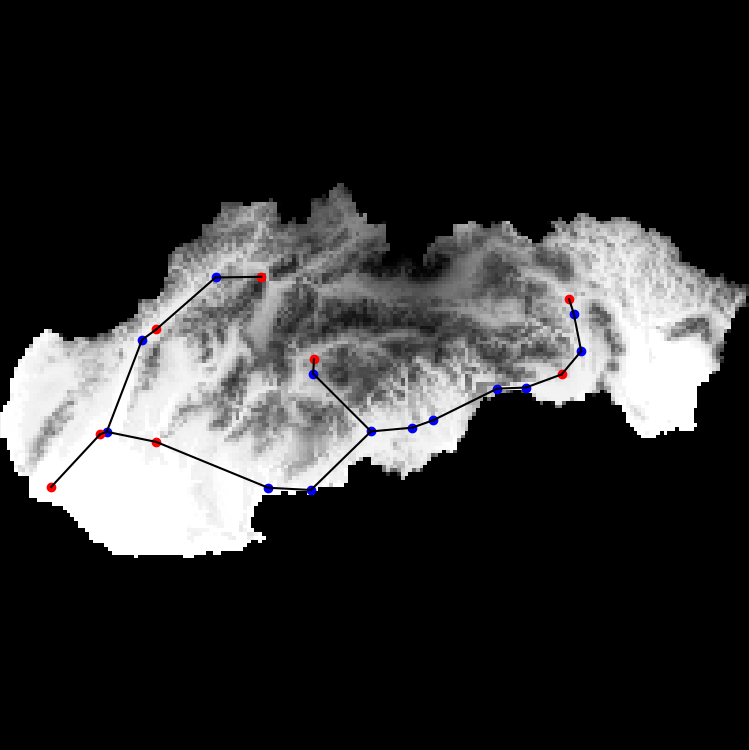
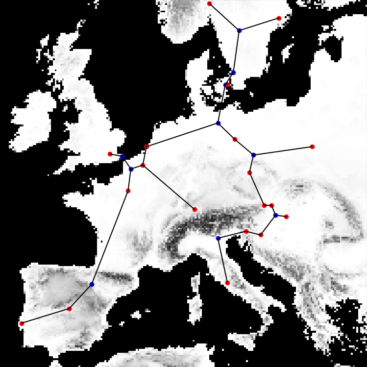
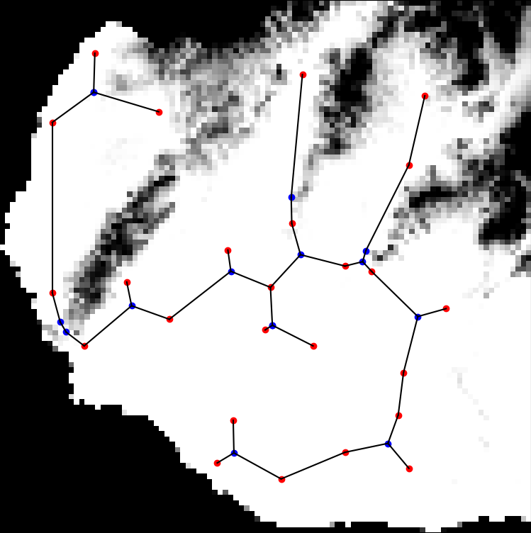
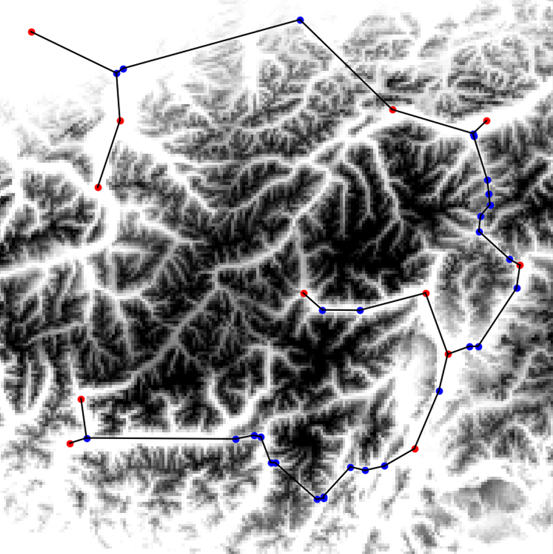

This repository contains the source code and test results for an algorithm developed as part of a thesis titled _"Evolutionary Optimization Algorithm for the Euclidean Steiner Tree Problem with Constraints"_.

The algorithm is implemented in Python and uses a genetic approach to solve the Euclidean Steiner Tree Problem with obstacles using raster-based representation mainly focused on terrain heightmaps.

## Repository Structure

- **example_results**  
  Contains example output images generated by the algorithm.

- **problem_instances**  
  Contains example problem instances:

  - `.png` files representing environments with obstacles
  - `.csv` files containing terminal points coordinates

- **results**  
  Contains results of tested instances. Some tested instances are from [ManouRosenberg/SteinerTreeProblemWithSoftObstacles](https://github.com/ManouRosenberg/SteinerTreeProblemWithSoftObstacles) and these instances are not included in this repository.

  - `graph_plot.py` — Used for creating graphs for the thesis

- **requirements.txt**  
  Specifies the required Python packages.

- **scripts**  
  Contains all implementation scripts:

  - `astar.py` — Implementation of the A\* pathfinding algorithm
  - `avoiding_steiner_points.py` — Functions for finding Steiner points used to avoid obstacle
  - `config.py` — Configuration file for setting algorithm parameters
  - `delauney_steiner_points.py` — Functions for finding Steiner points using Delaunay triangulation and the Simpson (Torricelli) method
  - `genetic_algorithm.py` — The main algorithm loop, implementing the genetic algorithm
  - `main.py` — The main file for running the algorithm, printing, and plotting results
  - `poly_to_raster.py` — Script to convert StOBGA problem instances to raster form for use in the algorithm
  - `tester.py` — A script for testing multiple instances in a row, used for testing StOBGA instances
  - `utils.py` — Utility functions and implementations of algorithms used throughout the codebase
  - `visuals.py` — Script for plotting the results using matplotlib

## Installation

### 1. Clone the Repository

```bash
git clone https://github.com/lblht/GA-EST-RO.git
```

### 2. Navigate to the Project Folder

```bash
cd GA-EST-RO
```

### 3. Create a Virtual Environment

- Windows:

  ```bash
  python -m venv venv
  ```

- macOS/Linux:
  ```bash
  python3 -m venv venv
  ```

### 4. Activate the Virtual Environment

- Windows:

  ```bash
  .\venv\Scripts\activate
  ```

- macOS/Linux:
  ```bash
  source venv/bin/activate
  ```

### 5. Install Required Packages

```bash
pip install -r requirements.txt
```

## Running the Algorithm

### 1. Set Paths to Problem Instances

In `main.py`, set the `obstacles_path` and `terminals_path` variables to point to the appropriate `.png` and `.csv` files located in the `problem_instances` folder.

### 2. Configure Parameters

Edit `config.py` to modify algorithm parameters.

### 3. Run the Algorithm

Run the Algorithm by running the `main.py` file.

Alternatively, you can call the function `run_algorithm(terminal_points, image)` from `genetic_algorithm.py` directly, as demonstrated in `main.py`.

During execution, the algorithm outputs progress information to the console and displays the final solution visually. All results are also returned via the `run_algorithm()`.

## Example Results





